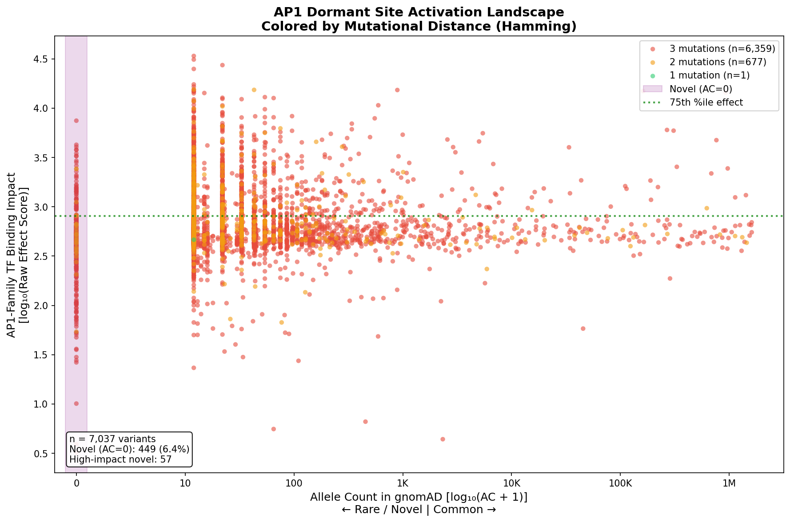

# AP1 Activation Landscape: Figure Comparison

## Summary
Two versions of the main activation landscape figure for discussion.

---

## Version 1: Original (Population Accessibility Score)

**X-axis formula:** `-log₁₀(AF) × Hamming Distance`

### Characteristics
- X-axis combines allele frequency AND mutational distance into single "accessibility" score
- Range: 0 to ~36
- Shows distinct vertical banding at X ≈ 12, 24, 36

### Pros
- Single composite score captures "how hard is it to reach this binding site?"
- Theoretically motivated: rare variants requiring more mutations = harder to access

### Cons
- **Artificial banding**: Discrete Hamming values (1, 2, 3) create visual artifacts
- **Double-counting**: Variants already exist in gnomAD, so Hamming distance is historical, not predictive
- **Hard to interpret**: "Population Accessibility Score of 25" is not intuitive
- **Misleading placement**: AF=0 variants forced to X=36 (edge) via pseudocount

---

## Version 2: New (Allele Count with Hamming as Color)

**X-axis:** `log₁₀(AC + 1)` where AC = Allele Count in gnomAD  
**Color:** Hamming Distance (1=green, 2=orange, 3=red)

### Characteristics
- X-axis is pure population frequency (how common is this variant?)
- Color preserves mutational distance information
- Novel variants (AC=0) cluster at X=0 with purple highlight

### Pros
- **No artificial banding**: Continuous distribution
- **Intuitive X-axis**: "Seen in 10 people" vs "seen in 100,000 people"
- **Novel variants highlighted**: 449 AC=0 variants clearly visible at left edge
- **Separates concerns**: Frequency (position) vs. mutational distance (color)
- **Biologically accurate**: These variants already exist; Hamming is supplementary info

### Cons
- Two visual encodings (position + color) may be slightly more complex
- Loses the "composite prioritization score" concept

---

## Key Differences

| Aspect | Original | New |
|--------|----------|-----|
| X-axis | Composite score | Pure allele count |
| Hamming distance | Multiplied into X | Encoded as color |
| AF=0 variants | Placed at X=36 (edge) | Placed at X=0 (highlighted) |
| Visual banding | Yes (artifact) | No |
| Interpretability | Complex | Intuitive |

---

## Data Highlights (Both Versions)

- **Total variants**: 7,037
- **Novel (AC=0)**: 449 (6.4%) — never observed in 800K gnomAD individuals
- **High-impact novel**: 57 variants with strong AP1 activation + AC=0
- **Hamming distribution**: 90.4% require 3 mutations, 9.6% require 2, 0.01% require 1

---

## Recommendation

**Use Version 2 (Allele Count)** for the rotation talk because:

1. Cleaner visualization without confusing bands
2. Easier to explain: "X-axis shows how rare the variant is in the population"
3. Properly highlights your 449 novel candidates at X=0
4. Color-coding Hamming distance lets you discuss it without distorting the main plot

**For publications**, could include both:
- Main figure: Version 2 (AC-based)
- Supplementary: Version 1 (composite score) with explanation of banding

---

## Questions for Discussion

1. Should we add a "high priority" quadrant shading like the original?
2. Do we want to annotate specific top candidates on the plot?
3. Should we generate a version with gene names labeled for top hits?
